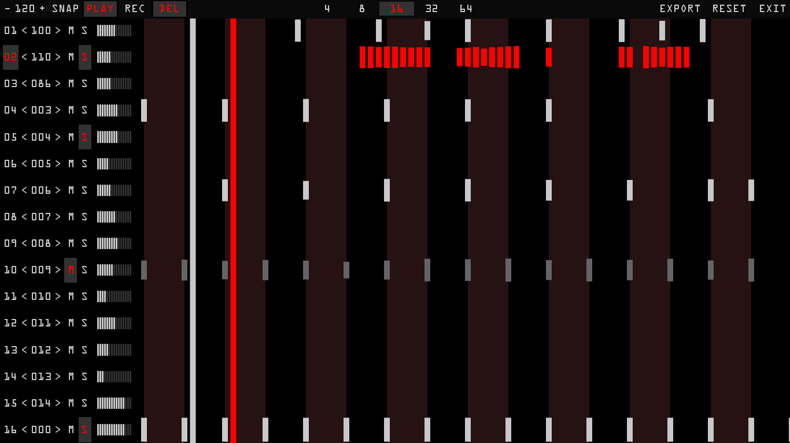

A midi sequencer inspired by MuLab (by MuTools) and GarageBand. 
Instead of providing a comprehensive music composition environment
as MuLab and GarageBand do, MidiEvo adopts a minimalistic design to
help musician improvise live music with a midi keyboard and a laptop.

MidiEvo loops over a sequence indefinitely as the musician develops
music on multiple tracks.

